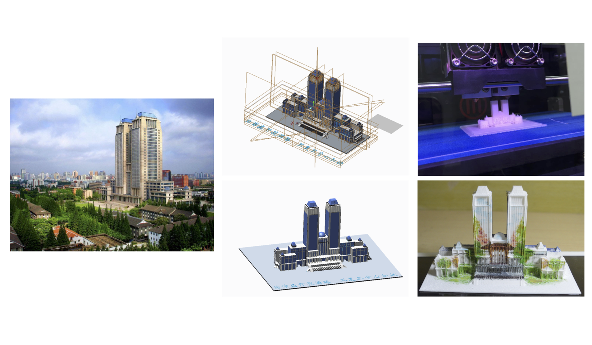

# 3D-Model-of-Fudan-Landmarks

This is a 3D model of a landmark building in Fudan University - Guanghua Twin Towers ([复旦大学光华楼](http://www.fudan.edu.cn/entries/view/731/))

The model is from my final project in <b>CAD Engineering Design</b> (COMP110007) lectured by Professor Xiaoguang Sun, which was designed by Creo 2.0. The stl file is provided for downloading.

More models may be designed and released later.

